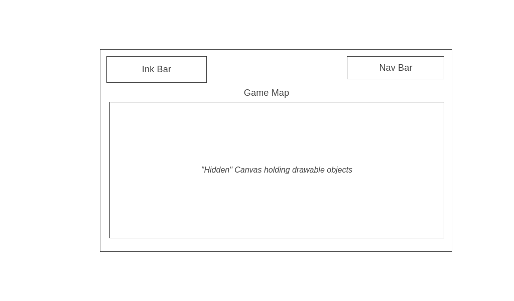

LInk is classic 2D interactive top-down / side scroller game. In LInk the user will need to navigate through the map using keys to move left and right and to jump, but wait whats this? Some platforms and materials cannot be reached with just the height of jumping! That is why the user will be to pick up ink pallets on the ground to fill up their ink bar. This will allow the user to fill in gaps in the map by 'drawing it in'. With the power of their brain and ink will the user be able to traverse the entirity of the map and reach the end! 

In LInk, user will be able to: 
- Navigate through the map going left, right , and jump
- Fill up an ink bar, by collecting ink pallets on the ground
- Unconver/Draw in hidden object on the map to reach the unreacable, at the cost of ink 
- Have access to a nav bar where sounds can be muted and have another look at instructions

I intend to use the following technologies: 
-Canvas to render background, character, ink pallets, and all platforms
-Webpack and Babel to bundle all my code 
-npm to manage project dependencies
-P5.js to allow users to draw (future implementation)

Between Friday and the weekend I hope to be able to render the player and allow them to move and have a gravity aspect to it (collision dectection with platforms)

On Monday I'd like to focus on stage building and map out specifics for how I want the stage to look and where to put platforms 

On Tuesday I want to be able to place ink pallets on the platforms to my discretion, and incorporate the ink bar to increase and decrease accordingly (hidden platforms that require ink will need to incorporated either this day or the day before)

On Wednesday I'll add background music and allowing for volume change alongside other nav bar componenets. Also touch up on any other parts that require! 